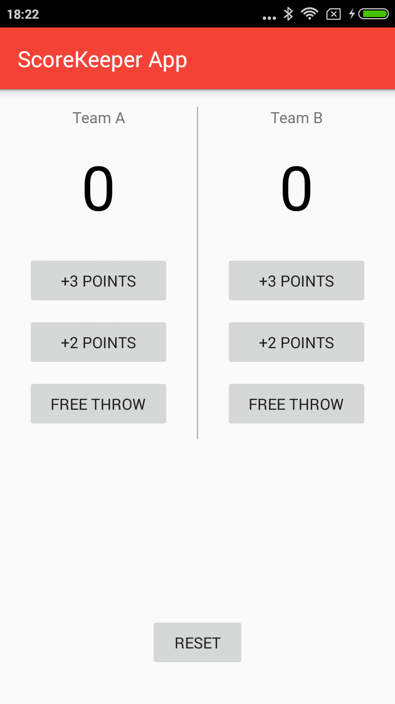
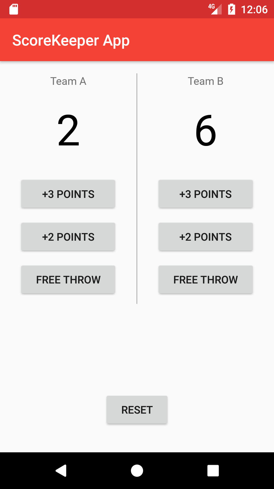

## ScoreKeeperApp
Score Keeper app which gives a user the ability to keep track of the score of two different teams playing a game of your choice.
Project which comes under Udacity Android Basics Nanodegree Program

## Project Overview
Design and implement a single screen app that displays information about a fictional small business.

## What I Learn
With Score Keeper, I will be practicing this skill set, with particular focus on button code, variable scope, and updating views.
This project is about combining various ideas and skills that i have practiced throughout my learning purpose. 
They include:
1. Adding button code to your app
2. Updating views
3. Properly scoping variables
4. Finding views by their ID

## Final Output - Screenshots

Screen 1                        |Screen 2                         |
:------------------------------:|:-------------------------------:|
 | |

## Download
You can download the apk here [ScoreKeeperApp](../../raw/master/app/screenshots/app-debug.apk)

